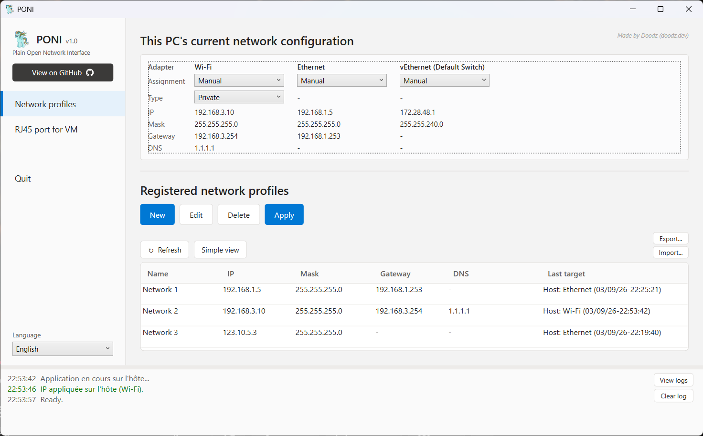
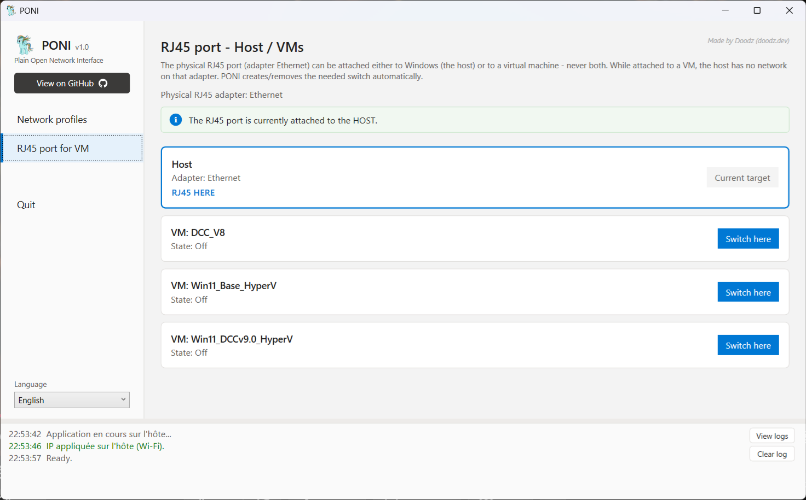

<h1 align="center">PONI</h1>
<p align="center"><em><b>P</b>lain <b>O</b>pen <b>N</b>etwork <b>I</b>nterface: a portable Windows network-profile switcher</em></p>

<p align="center"></p>

<p align="center">
  <a href="https://github.com/DoodzProg/PONI/releases/latest/download/PONI.exe">
    
  </a>
</p>

<p align="center">
  
  
  
</p>

---

# Download

One portable `.exe`. No installer, no dependencies. It raises its own UAC prompt and keeps
everything in `%APPDATA%\PONI\`.

### Get it

1. Click **[Download PONI v1.0](https://github.com/DoodzProg/PONI/releases/latest/download/PONI.exe)** (or the [Releases page](https://github.com/DoodzProg/PONI/releases/latest)).
2. Put `PONI.exe` wherever you want (a folder, a USB stick). Nothing else to copy.
3. Double-click, accept the UAC prompt, done.

### What it does

PONI has two screens.

**Network profiles**

The interface for the IP configurations you switch between often.

<p align="center"></p>

* **Create, edit, delete and apply** profiles. A profile holds an IP address, a subnet
  mask (`255.255.255.0` form), a gateway and any number of DNS servers, all validated as
  you type.
* *Import current config* fills a new profile straight from an adapter's real settings.
* On **apply**, you choose the target each time (it is not baked into the profile):
  * a **host network adapter**, or
  * a **running Hyper-V VM** plus one of its adapters, applied via PowerShell Direct.
    Inside the VM the right adapter is found by **MAC address**, so its `Ethernet N` name
    does not matter.

  PONI remembers your last target per profile and shows when it was last applied.
* **Export / import**: save a profile set to a JSON file, all of them or a hand-picked
  selection, and import one back. Handy to move configs between machines or share custom
  ones with someone.
* **Simple or detailed table**: a compact view (name / IP+mask / last target) or a full
  one with separate IP, mask, gateway and DNS columns.
* A panel at the top shows the PC's **current live network config**.

**RJ45 port for VM**

The interface for Hyper-V VMs: it decides whether the PC's physical RJ45 port feeds
Windows (the host) or a virtual machine.

<p align="center"></p>

* One click routes the port to the host or to any detected VM.
* PONI **creates and removes the Hyper-V switch it needs on its own**, adds the adapter
  inside the VM, and tears it all down when you switch back.
* A permanent banner explains the concept and a coloured box always shows where the port
  points right now.

**Throughout**

* French / English, switchable at any time.
* Every network action is **checked against the real system** before it is reported as
  done, and runs in the background so the window never freezes.
* A **resizable log** at the bottom keeps a timestamped, colour-coded history; a button
  opens the log folder.

### Requirements

* Windows 10 / 11 (x64), administrator rights (the UAC prompt is automatic).
* PowerShell 5.1 + WPF / .NET Framework, already present on any up-to-date Windows.
* Hyper-V only for the VM and RJ45&#8596;VM features.

---

# For developers

Everything is in one file: [`PONI.ps1`](PONI.ps1) (business logic + the WPF UI as embedded XAML).

### Build

```powershell
powershell -ExecutionPolicy Bypass -File .\Build.ps1
```

`Build.ps1` pulls the `ps2exe` module if it's missing, embeds `assets/PONI_icon.png` as
the in-app logo, takes the exe icon from `assets/PONI_icon.ico`, and compiles `PONI.ps1`
into `PONI.exe` (`-requireAdmin -noConsole -STA -x64 -DPIAware`).

If Group Policy forces `RemoteSigned` and the script is blocked, run `Unblock-File .\Build.ps1` once.

### Modify

Edit `PONI.ps1`, run `Build.ps1` again. That's the whole loop.
`PONI.exe` is not committed; it ships as a Release asset.

---

## License

[MIT](LICENSE) &copy; 2026 Gaëtan Lacoffrette
