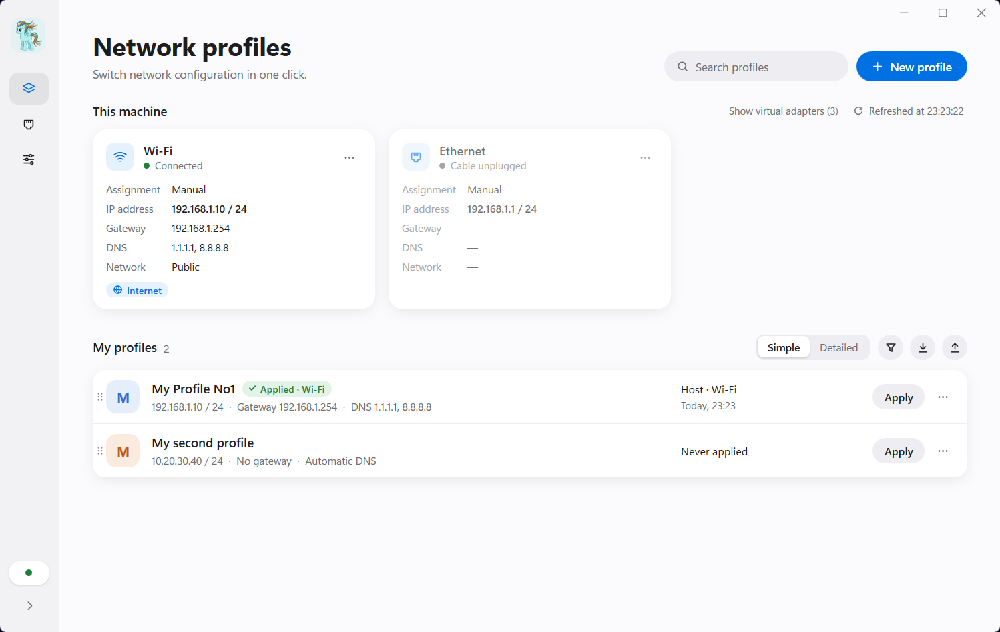
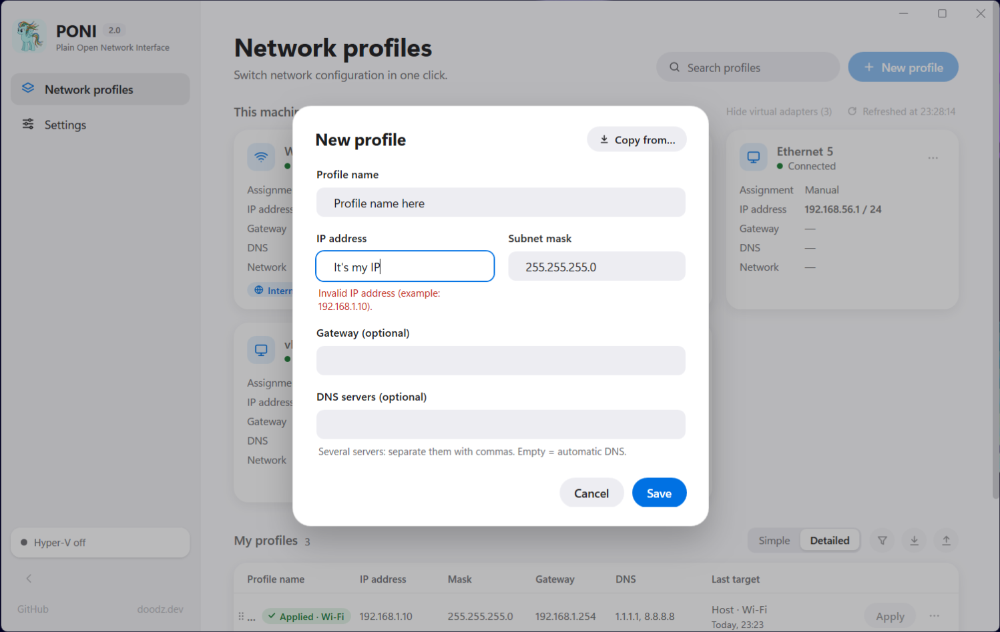
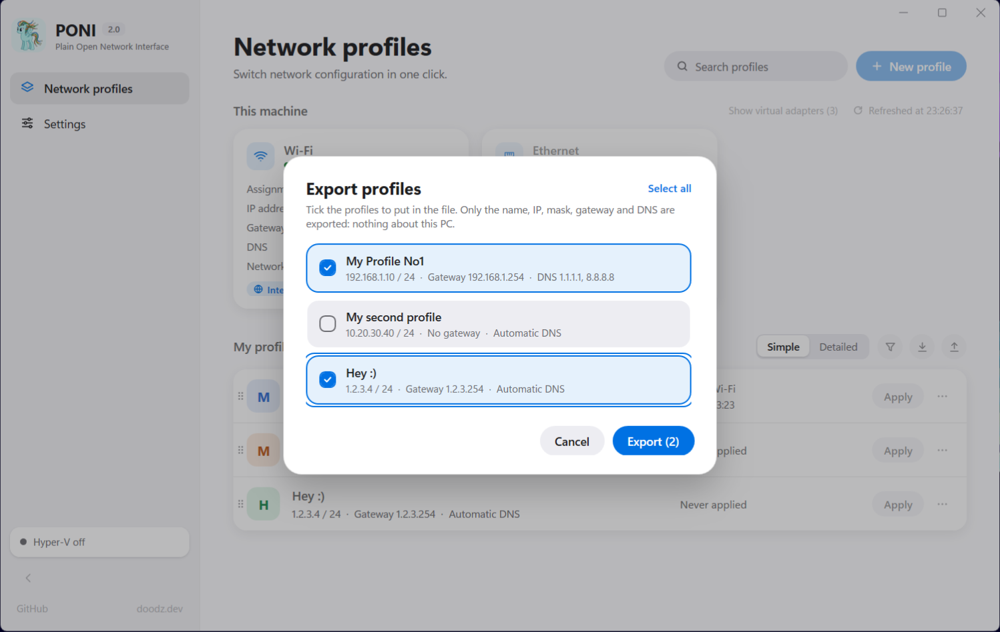
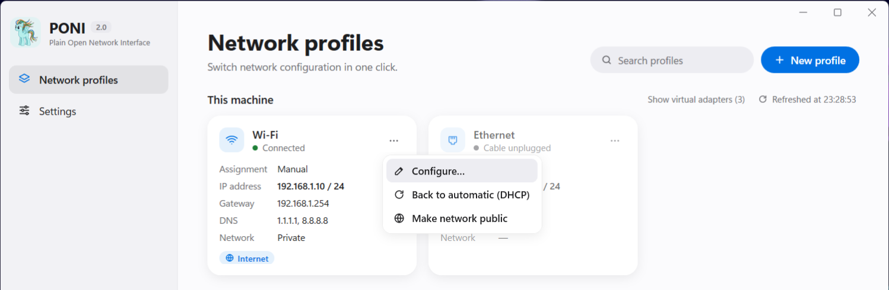
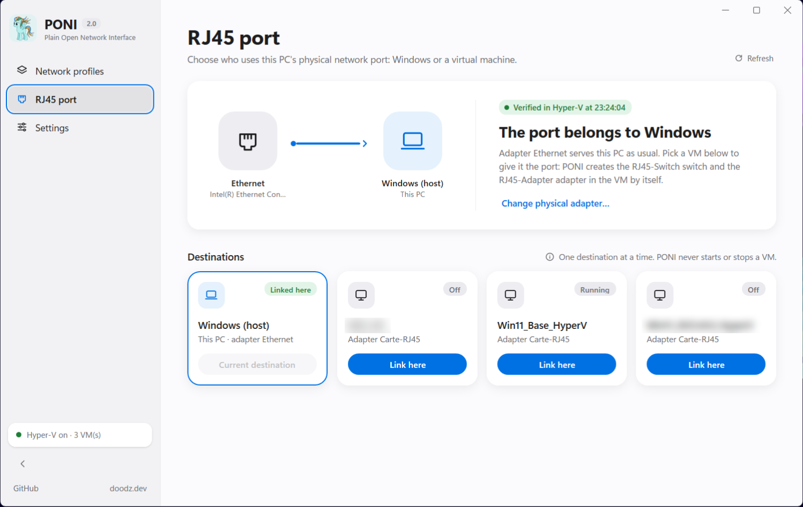

<h1 align="center">
  <br>
  PONI
</h1>
<p align="center"><em><b>P</b>lain <b>O</b>pen <b>N</b>etwork <b>I</b>nterface: switch your PC's network settings in one click</em></p>

<p align="center">
  <a href="https://github.com/DoodzProg/PONI/releases/latest/download/PONI.exe">
    
  </a>
</p>
<p align="center">
  <sub>One file, nothing to install &middot; Windows 10 / 11 (64-bit) &middot; free and open source (MIT)</sub>
</p>

<p align="center">
  <picture>
    <source media="(prefers-color-scheme: dark)" srcset="assets/screenshots/profiles-dark.png">
    
  </picture>
</p>

---

## Get started

1. **[Download PONI.exe](https://github.com/DoodzProg/PONI/releases/latest/download/PONI.exe)**.
2. Put it anywhere you like: a folder, the desktop, a USB stick. That single file is the whole app.
3. Double-click it and accept the administrator prompt (changing network settings needs it).

> **"Windows protected your PC"?** PONI is not code-signed (a certificate costs hundreds of
> euros a year for a free tool), so Windows SmartScreen may warn you the first time.
> Click **More info**, then **Run anyway**. The source code is right here, and every release
> comes with a SHA-256 checksum (see [Verify your download](#verify-your-download)).

---

## What it does

### Network profiles

Save the IP configurations you use often (office, lab bench, customer site, a device to set
up...) and switch between them in one click instead of digging through Windows settings.

* A **profile** holds an IP address, a subnet mask, a gateway and DNS servers, all checked
  as you type. *Copy from...* fills it from one of your adapters.
* **Apply** asks where: one of this PC's network adapters, or a virtual machine (see below).
  If something goes wrong, the previous configuration is **put back automatically**.
* The **"This machine"** cards show every adapter live: DHCP or manual, IP, gateway, DNS,
  network type, Internet access. Their menu gives quick actions: configure, back to
  automatic (DHCP), private / public network.
* **Simple or detailed** list, search, and **sorting**: by name, by creation date, or your
  own order by dragging profiles by their handle.
* **Export / import** to a JSON file (all profiles or a selection) to move them to another
  PC or share them. Only the network settings go in the file, nothing about your PC.

<p align="center">
  
  
</p>
<p align="center">
  
</p>

### RJ45 port and Hyper-V virtual machines

For people who plug equipment into their PC to reach it from a **Hyper-V virtual machine**.
This part appears only when Hyper-V is installed, and can be switched off in Settings.

* **Give the PC's Ethernet port to a VM** in one click, or give it back to Windows. PONI
  creates and removes the Hyper-V switch it needs, and only ever touches its own.
* **Apply a profile inside a running VM** (PowerShell Direct, with the VM's credentials).
  The VM's adapter is found by its MAC address, whatever its name is inside the VM.
* The VM can **answer ping** from the devices on its network (a firewall rule of PONI's own,
  local network only; can be turned off).
* Detects and repairs VMs that Hyper-V refuses to start because a network adapter points to
  a switch that no longer exists.

<p align="center">
  
</p>

### And also

* **English / French**, light / dark / system theme.
* A built-in **log** of everything PONI read and changed (kept 30 days), easy to copy into a
  bug report.
* Collapsible sidebar, Windows 11 snap layouts, and keyboard shortcuts:

  | Keys | Action |
  |---|---|
  | `Ctrl`+`1` / `2` / `3` | Network profiles / RJ45 port / Settings |
  | `Ctrl`+`N` | New profile |
  | `Ctrl`+`F` | Search profiles |
  | `F5` | Refresh the current screen |
  | `Ctrl`+`B` | Collapse / expand the sidebar |

---

## Good to know

**Requirements.** Windows 10 (version 1903 or later) or Windows 11, 64-bit, and an
administrator account. Everything else (.NET Framework 4.8, Windows PowerShell 5.1) is already
part of Windows. Hyper-V is only needed for the virtual machine features.

**Your data.** Profiles and settings are stored in `%APPDATA%\PONI\store.json` (with an
automatic backup), the log in `%APPDATA%\PONI\logs\`. PONI never sends anything over the
Internet.

**What PONI changes, and what it never touches.** It changes the IP settings of the adapter
you choose, and, only if you use the VM features, its own Hyper-V switch `RJ45-Switch`, the
network adapters of your VMs and its own firewall rule `PONI-Ping-In` inside a VM. It never
starts or stops a VM and never modifies your other switches or firewall rules.

**Coming from PONI 1.0?** Just replace the old `PONI.exe`: your profiles are imported
automatically on the first launch (the old file is left untouched).

### Verify your download

Each release lists the SHA-256 of `PONI.exe`. To compare, open PowerShell in the download
folder:

```powershell
Get-FileHash .\PONI.exe -Algorithm SHA256
```

---

## For developers

PONI 2 is written in C# / WPF on .NET Framework 4.8, with no third-party library, and ships
as a single `PONI.exe`. Network reads use WMI; changes run the Windows PowerShell network and
Hyper-V cmdlets in-process, from scripts embedded in the exe.

| Path | Content |
|---|---|
| `src/PONI/` | The application |
| `src/PONI/Core/` | Models, validation, JSON, data file, v1 migration, import / export, sorting |
| `src/PONI/Services/` | Network, Hyper-V, PowerShell host, theme, language, log |
| `src/PONI/Scripts/` | PowerShell scripts embedded in the exe (every system change) |
| `src/PONI/Themes/`, `Strings/` | Design system; English / French strings |
| `tests/PONI.Tests/` | Unit tests (xUnit) |
| `assets/` | Logo, icon, screenshots |

**Build.** Requires the [.NET SDK](https://dotnet.microsoft.com/download) 8.0 or later, to
build only:

```powershell
powershell -ExecutionPolicy Bypass -File .\build.ps1                         # tests, then dist\PONI.exe + .sha256
powershell -ExecutionPolicy Bypass -File .\build.ps1 -Configuration Debug    # runs without admin rights (UI work)
```

The Debug build refuses every system change, and the `PONI_DATA_DIR` environment variable
points PONI to another data folder, so the UI can be worked on safely. GitHub Actions runs the
tests and builds the exe on every push. See [CHANGELOG.md](CHANGELOG.md) for the history.

---

## License

[MIT](LICENSE) &copy; 2026 Gaëtan Lacoffrette
